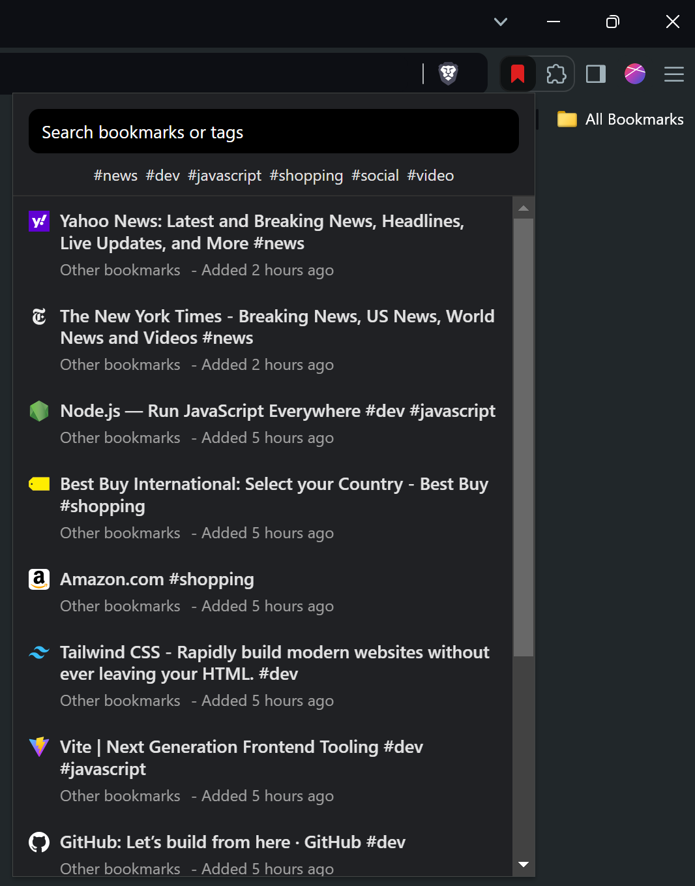

# Bookmark Search Extension

Chrome extension to quickly search for bookmarks. Supports tags using `#`.

## Introduction

Chrome and other Chromium browsers do not offer tags or labels for bookmarks by default. A simple workaround is to add your own tags at the end of a bookmark title, for example:
`Amazon.com #shopping`

By using tags, you no longer need to worry about which folder a bookmark should be saved to. In addition, it also allows you to add multiple tags to a single bookmark.

This extension lists all of your bookmarks from all folders along with their tags for easier searching:



## Install

This extension is not available on the Chrome store. You need to manually build it and load it into your browser.

Requirements:

- [Node](https://nodejs.org) major version `20`

Steps:

1. Clone this repository
2. Open your terminal/cmd and run:

   ```shell
   npm i
   npm run build
   ```

3. Open Chrome or any other Chromium browser
4. In the address bar, type in `chrome://extensions` and press Enter
5. Toggle the `Developer mode` in the extensions page
6. Click on `Load unpacked` and select the `dist` folder located in the repository's folder

## Privacy

This extension **does NOT share any of your data**. It only requires the following permissions to function:

1. `bookmarks`: allows extension to access your bookmarks so they can be displayed.
2. `favicons`: loads favicons for your bookmarks.
